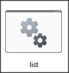
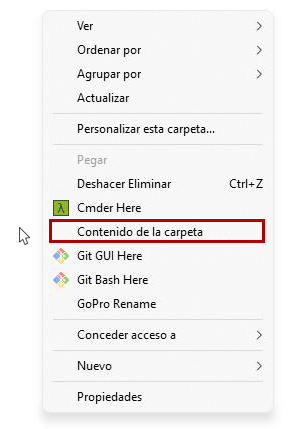
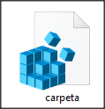
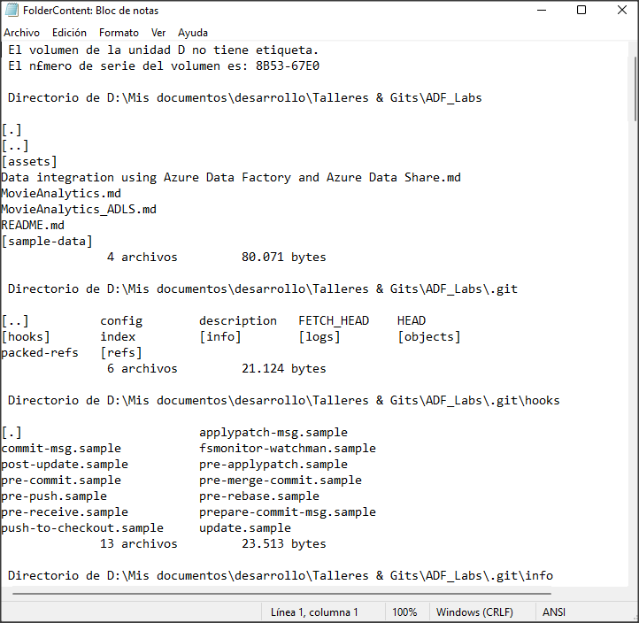

# **Como obtener listado de archivos y subcarpetas de un directorio en Windows**

La idea es tener un resumen agrupado por subcarpeta y en columnas horizontales y con un resumen de totalidad de archivos en un en un block de notas.

Para ello creamos un archivo llamado **list.bat** 

 

y lo guardamos dentro de la carpeta de Windows y escribimos el siguiente código dentro de el.

```bash
@echo off
dir %1 /w /a:-h /-p /s > "%temp%\FolderContent"
start /w notepad "%temp%\FolderContent"
exit
```

Aquí lo que estamos diciendo en la línea dos del código es que liste lo que hay dentro de la carpeta con **/w** ordenamos en columna horizontal con **/a:-h** especifica el atributo oculto para que liste incluso si son archivos ocultos **-p** que no haga pausas **/s** que liste incluso archivos del sistema **>"%temp%\FolderContent"** crea un archivo llamado **FolderContent** sin extensión dentro de la carpeta de **temp** del sistema de Windows el cual sera reescrito cada vez que ejecutemos el menú contextual, después inicializamos el block de notas **start /w notepad "%temp%\FolderContent"** abriendo el archivo ubicado en la carpeta **temp** y el **exit** solo se ejecuta cuando cerremos el block de notas. Ahora vamos a asignarle un nuevo menú contextual de **Windows** dentro de la carpeta y no sobre la carpeta, con el valor el nombre contenido de la carpeta



para ello creamos un archivo de registro **.reg** con el siguiente código

```reg
Windows Registry Editor Version 5.00
[HKEY_CLASSES_ROOT\Directory\Background\shell\Contenido de la carpeta]
[HKEY_CLASSES_ROOT\Directory\Background\shell\Contenido de la carpeta\Command]
@="C:\\windows\\list.bat"
```

y lo que hace es crear dentro del **shell** de la carpeta da el nombre contenido de la carpeta y va y busca el archivo **list.bat** que esta dentro de la carpeta de Windows, de esta forma no va a imprimir lo que esta en la carpeta **Windows** sino lo que esta en la carpeta que elijamos con el clic derecho del mouse. 

Guardamos y le damos el nombre contenido de **carpeta.reg**



Después doble clic para agregar los valores a el registro de Windows dando como resultado algo como esto



De esta forma podemos listar todo lo que hay dentro de un disco duro o carpeta.
